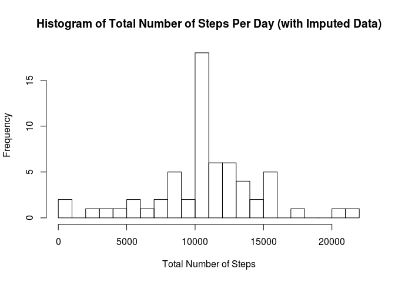

# Peer Assessment 1
Yiu Ming Huynh  
05/15/2015  

### Code Generation

1. The following code downloads and unzips the content to the current working directory:


```r
library(RCurl)
```

```
## Loading required package: bitops
```

```r
URL <- "https://d396qusza40orc.cloudfront.net/repdata%2Fdata%2Factivity.zip"

# Retrieve the file as a binary, since it is not in text format
bin <- getBinaryURL(URL, ssl.verifypeer=FALSE) 

# Save the binary into a zip file on the hard disk.
FILENAME <- "represearch_assessment1.zip"
con <- file(FILENAME, open="wb")
writeBin(bin, con)
close(con)

# Unzip the file and access its contents.
data <- read.csv(unzip(FILENAME))
```

2. The following code removes NAs from the dataset:


```r
# Ensure all NAs are not included in the data.
complete_data <- data[complete.cases(data),]
```

### Mean Total Number of Steps Taken Per Day

1. & 2. Here is a histogram of the total number of steps taken each day.


```r
# Aggregate the data by date by summing up the steps taken throughout the day.
aggregated_data <- aggregate(complete_data$steps, by=list(date=complete_data$date), FUN=sum)
# Display the histogram
hist(aggregated_data$x, breaks=20, main="Histogram of Total Number of Steps Per Day", xlab="Total Number of Steps")
```

 

#### Mean

3a. The mean is reported below:


```r
mean(aggregated_data$x)
```

```
## [1] 10766.19
```

#### Median

3b. The median is reported below:


```r
median(aggregated_data$x)
```

```
## [1] 10765
```

### Average Daily Activity Pattern

1. A plot of the average daily activity across all days by interval is generated with the following code:


```r
# Aggregate the data by interval by taking the average of the same interval from each day.
aggregated_by_interval_data <- aggregate(complete_data$steps, by=list(interval=complete_data$interval), FUN=mean)
# Plot the data.
plot(aggregated_by_interval_data$interval, aggregated_by_interval_data$x, 'l', xlab="Interval Number", ylab="Number of Steps", main="Time Series Plot of Number of Steps Over Intervals")
```

 

2. The following code finds the max of the dataset:


```r
# Find the maximum of the average number of steps per interval.
max_avg_steps <- max(aggregated_by_interval_data$x)
# Find the dataframe that has the maximum.
max_avg_steps_df <- aggregated_by_interval_data[aggregated_by_interval_data$x == max_avg_steps,]
# Enumerate the intervals that contain the maximum.
max_avg_steps_df$interval
```

```
## [1] 835
```

### Imputing Missing Values

1. The following code calculates the number of NAs in the data:


```r
# data contains unprocessed data and therefore also has the NAs
# complete_data contains the data with the NAs removed
# To find the number of NAs, you take the number of rows in data and subtract it with the number of rows in complete_data
nrow(data) - nrow(complete_data)
```

```
## [1] 2304
```

2. The strategy to imputing missing values is detailed below:
- For every interval that contains a NA, take the average steps of all intervals and impute that value for the time interval that has missing data.

3. The following code implements the replacement strategy:

```r
library(data.table)

# Convert data frames into data tables.
imputed_data_table <- data.table(data, key=c("interval"))
aggregate_interval_data_table <- data.table(aggregated_by_interval_data, key=("interval"))
# Merge the two data tables by interval.
imputed_data_table <- imputed_data_table[aggregate_interval_data_table]
# For every step that is NA, replace it with the mean of the steps for the current interval.
imputed_data_table[is.na(steps),steps:= as.integer(x)]
```

```
##        steps       date interval        x
##     1:     1 2012-10-01        0 1.716981
##     2:     0 2012-10-02        0 1.716981
##     3:     0 2012-10-03        0 1.716981
##     4:    47 2012-10-04        0 1.716981
##     5:     0 2012-10-05        0 1.716981
##    ---                                   
## 17564:     0 2012-11-26     2355 1.075472
## 17565:     0 2012-11-27     2355 1.075472
## 17566:     0 2012-11-28     2355 1.075472
## 17567:     0 2012-11-29     2355 1.075472
## 17568:     1 2012-11-30     2355 1.075472
```

4a. The following code displays the histogram with the imputed data for each day:

```r
aggregate_imputed_data <- aggregate(imputed_data_table$steps, by=list(date=imputed_data_table$date), FUN=sum)
aggregate_imputed_data$steps <- aggregate_imputed_data$x
hist(aggregate_imputed_data$steps, breaks=20, main="Histogram of Total Number of Steps Per Day (with Imputed Data)", xlab="Total Number of Steps")
```

 

4b. The mean:

```r
mean(aggregate_imputed_data$steps)
```

```
## [1] 10749.77
```

4c. The median:

```r
median(aggregate_imputed_data$steps)
```

```
## [1] 10641
```

4d. The values do differ from the first histogram, because imputing the NAs with the average of the intervals increased the total number of steps taken per day. So instead of not counting them, they are added to the running total by using the average of that interval as an estimate.

### Differences in Activity Patterns During Weekdays and Weekends

1. The code uses the weekday() function and stores that information in the weekday column. It then creates a factor variable called weekday_type

```r
# Coerce the date column as a Date and run weekdays, storing the vector into the weekday column of the imputed
# date table
imputed_data_table$weekday <- weekdays(as.Date(imputed_data_table$date))
# Mark weekdays as not being weekends
imputed_data_table[weekday != "Saturday" & weekday != "Sunday", "is_weekend"] <- "weekday"
# Mark weekends as being weekend (they are actually marked as NAs from the above operation)
imputed_data_table[is.na(is_weekend),is_weekend := "weekend"]
```

```
##        steps       date interval        x   weekday is_weekend
##     1:     1 2012-10-01        0 1.716981    Monday    weekday
##     2:     0 2012-10-02        0 1.716981   Tuesday    weekday
##     3:     0 2012-10-03        0 1.716981 Wednesday    weekday
##     4:    47 2012-10-04        0 1.716981  Thursday    weekday
##     5:     0 2012-10-05        0 1.716981    Friday    weekday
##    ---                                                        
## 17564:     0 2012-11-26     2355 1.075472    Monday    weekday
## 17565:     0 2012-11-27     2355 1.075472   Tuesday    weekday
## 17566:     0 2012-11-28     2355 1.075472 Wednesday    weekday
## 17567:     0 2012-11-29     2355 1.075472  Thursday    weekday
## 17568:     1 2012-11-30     2355 1.075472    Friday    weekday
```

```r
# Create the weekday type factor variable
imputed_data_table$weekday_type <- factor(imputed_data_table$is_weekend, levels = c("weekday", "weekend"))
```

2. The code below creates a panel plot

```r
library(lattice)
# get all the weekday data
weekday_data <- imputed_data_table[weekday_type == 'weekday']
# aggregate by intervals using the mean
aggregated_weekday_data <- aggregate(weekday_data$steps, by=list(interval=weekday_data$interval), FUN=mean)
# recreate the weekday factor variable
aggregated_weekday_data$weekday_type <- factor("weekday")
# get all the weekend data
weekend_data <- imputed_data_table[weekday_type == 'weekend']
# aggregate by intervals using the mean
aggregated_weekend_data <- aggregate(weekend_data$steps, by=list(interval=weekend_data$interval), FUN=mean)
# recreate weekend factor variable
aggregated_weekend_data$weekday_type <- factor("weekend")
# combine both vectors
both_aggregated <- rbind(aggregated_weekday_data, aggregated_weekend_data)
# create the xyplot
xyplot(both_aggregated$x ~ both_aggregated$interval | factor(both_aggregated$weekday_type), type="l", main="Average Steps Per Interval", xlab="Intervals", ylab="Number of Steps")
```

 

From the data above, it seems like on average, this person gets a decent walk on a weekend afternoon.
